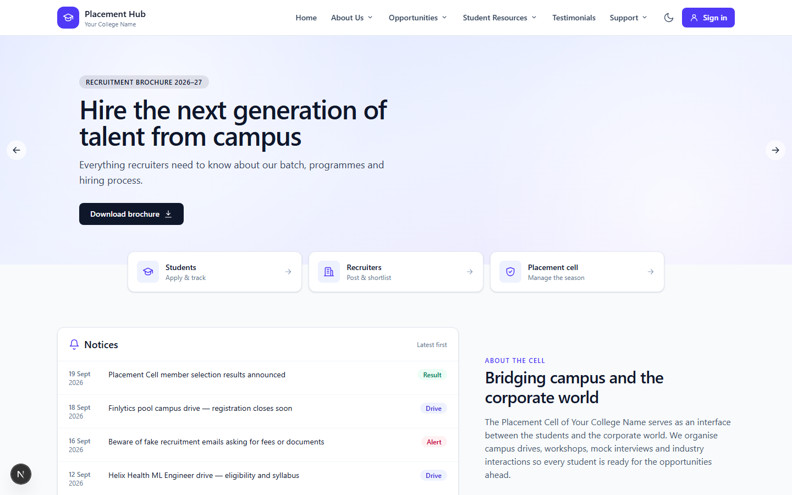
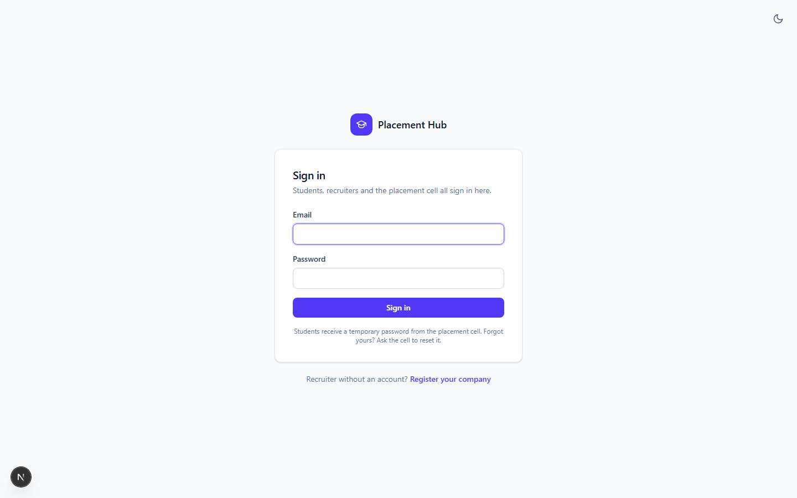
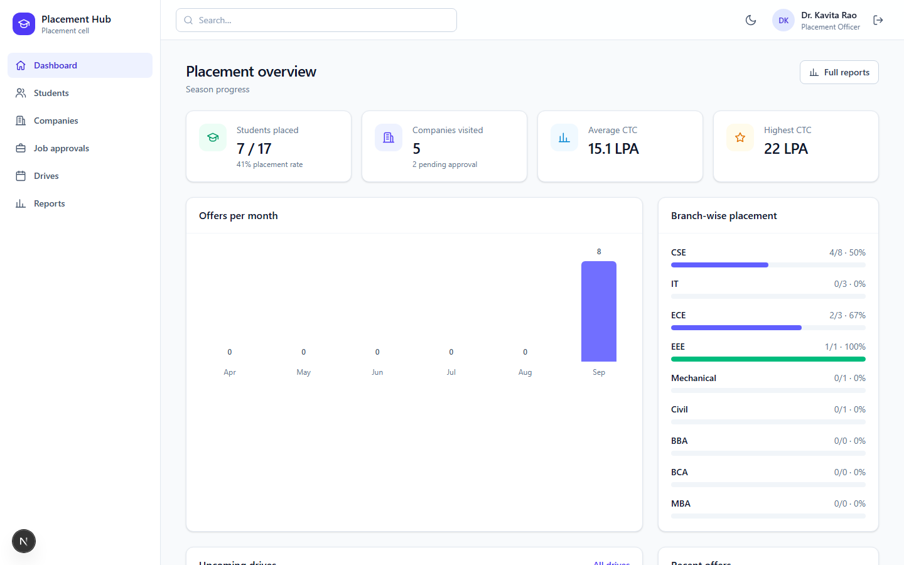
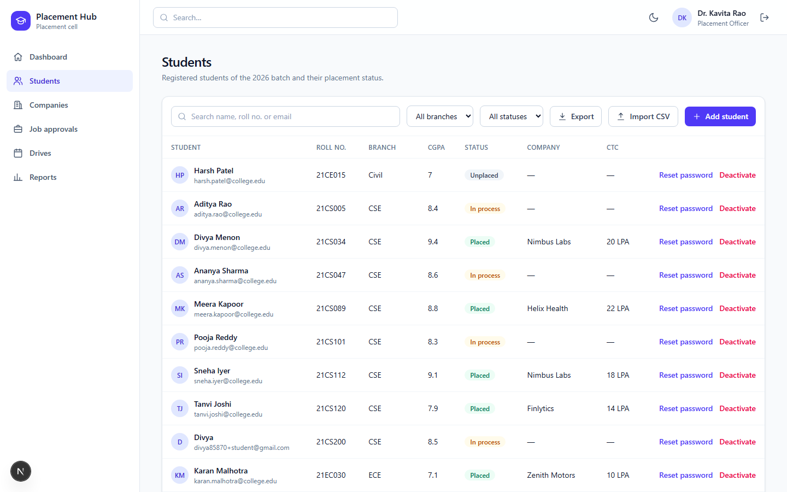

# Placement Hub — frontend

**Live site: [placementhub-sepia.vercel.app](https://placementhub-sepia.vercel.app)**

Next.js (App Router) frontend for Placement Hub: separate portals for **students**, **companies** and the
**placement cell**, talking to the [placementhub-backend](https://github.com/noobdivya/placementhub-backend) API.

Live stack: this app on [Vercel](https://vercel.com) → [placementhub-backend](https://github.com/noobdivya/placementhub-backend) on [Render](https://render.com) → [Neon](https://neon.tech) (Postgres).

## Screenshots

| Landing page | Sign in |
|---|---|
|  |  |

| Placement cell — dashboard | Placement cell — students |
|---|---|
|  |  |

## Stack

- [Next.js 16](https://nextjs.org) (App Router) + React 19 + TypeScript
- Tailwind CSS v4
- No client-side data-fetching library — a small typed `fetch` wrapper (`lib/api.ts`) plus a couple of
  hooks (`lib/hooks.ts`) handle loading/error state and access-token refresh

## Quick start (local)

```bash
npm install
cp .env.example .env.local        # set NEXT_PUBLIC_API_URL if the API isn't on localhost:8080
npm run dev                       # http://localhost:3000
```

Run the [backend](https://github.com/noobdivya/placementhub-backend) alongside it (`docker compose up -d db && go run ./cmd/api` there) —
this app has no API routes of its own; every request goes to `NEXT_PUBLIC_API_URL`.

```bash
npm run build   # production build
npm run start   # serve the production build
npm run lint    # eslint
```

## Structure

```
app/
  page.tsx                 marketing / landing page
  login/, register/, change-password/   auth flows
  students/                 student portal (jobs, applications, profile)      layout.tsx = portal shell + guard
  companies/                 company portal (post jobs, candidates)
  placementcell/              placement-cell portal (students, companies, drives, reports)
components/                shared UI: Shell, PortalShell, tables, boards, dialogs, icons
lib/
  api.ts                    typed fetch client — base URL, auth headers, access-token refresh/retry
  auth.tsx                  AuthProvider / useAuth (session state, login/logout)
  hooks.ts                  useFetch and friends (loading/error wrapper around lib/api)
  data.ts                   shared types/constants mirrored by the backend's domain model
  theme.ts                  light/dark theme toggle (localStorage + prefers-color-scheme)
```

Each portal's `layout.tsx` redirects unauthenticated or wrong-role users to `/login` — routing itself carries
no authorization logic beyond that guard; the API is the source of truth for what a user can see or do.

## Configuration

| Variable | Required | Notes |
|---|---|---|
| `NEXT_PUBLIC_API_URL` | yes | Base URL of the backend API, no trailing slash, e.g. `http://localhost:8080` locally or `https://placementhub-backend.onrender.com` in production. Conversely, *this app's own origin* (e.g. `https://placementhub-frontend.vercel.app`) must be listed in the backend's `CORS_ALLOWED_ORIGINS`. |

`NEXT_PUBLIC_*` variables are inlined into the JavaScript bundle **at build time**. Setting or changing
`NEXT_PUBLIC_API_URL` in Vercel always requires a new build (a redeploy), not just a restart.

Auth state: the access token is kept in memory only (never `localStorage`); the refresh token is an `httpOnly`
cookie set by the backend, scoped to its own `/auth` path, sent automatically via `credentials: "include"`. This
is why the backend's cookie settings (`COOKIE_SAMESITE`, `COOKIE_SECURE`) matter once frontend and backend are
on different domains.

## Notes

- Web Push (browser notifications) is implemented on the backend (`GET /push/vapid-public-key`, subscribe/unsubscribe
  endpoints) but this frontend does not yet register a service worker or prompt for permission — the in-app
  notification inbox works without it. Adding push here later needs a `public/sw.js` handling `push` and
  `notificationclick`, and a permission-request button; see the [backend README](https://github.com/noobdivya/placementhub-backend#notifications-v1).
- There is no server-side rendering of private data — every portal page is a client component that calls the
  API after mount, so there's nothing to cache or invalidate on the Next.js server itself. Vercel's default
  caching for static/marketing pages (`/`, `/login`, `/register`) applies normally.
